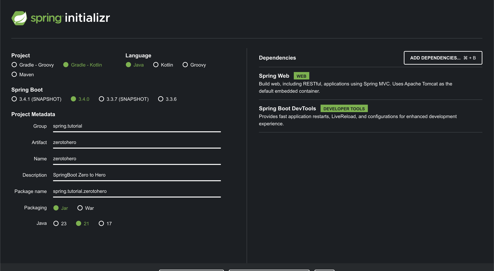

# SpringBoot Zero to Hero

## Step One - Initial Setup - controllers and services

We start with an application from scratch and incrementally build it to productionize in a cloud environment.
The business logic is simple, it allows users to book accommodation.

### Data Model

We start with very basic data model to keep it simple and illustrate the concepts.

##### User
```json
{}
```
##### Booking
```json
{}
```

### Starter Project

We generate the project from [Spring Initializr](https://start.spring.io) with dependency of just Spring Web and 
Spring Developer Tools. We will add other dependencies along the way as we need them.



### Run The Application

```
./gradlew bootRun
```

### Add First Controller

#### Booking Controller

Define REST endpoints to get bookings, get booking by id and create a booking.

Create a `BookingService` class to manage bookings in memory for now which we will replace with a database shortly.

Also test the controller using `TestRestTemplate` class.


## Step Two -